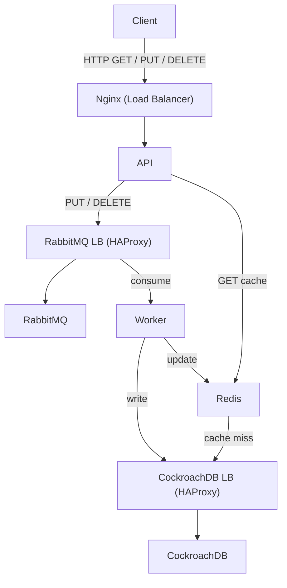

# Key-Value Store Distribuído

Este projeto consiste numa aplicação de armazenamento **chave-valor distribuída**, desenvolvida no âmbito da unidade curricular de **Sistemas Paralelos e Distribuídos**.

A aplicação segue uma arquitetura baseada em **microserviços**, integrando:

* **API REST em Spring Boot**
* **Cache distribuída com Redis Cluster**
* **Sistema de mensagens assíncronas com RabbitMQ Cluster**
* **Persistência distribuída com CockroachDB**
* **Balanceamento de carga com NGINX e HAProxy**
* **Execução e orquestração com Docker e Docker Compose**


## Arquitetura



### Componentes:

* **NGINX**: Entrada das requisições (porta 8000)
* **Spring Boot APIs** (`api-1`, `api-2`, `api-3`): Expõem endpoints REST (`PUT`, `GET`, `DELETE`)
* **Redis Cluster** (6 nós): Armazenamento temporário chave-valor
* **RabbitMQ Cluster** (3 nós): Comunicação assíncrona com quorum queues
* **Consumers Python** (3 instâncias): Tratam as mensagens e gravam dados
* **CockroachDB** (3 nós): Base de dados relacional distribuída
* **HAProxy**: Balanceador interno (DB e RabbitMQ)

---

## Tolerância a Falhas, Replicação e Análise CAP

Este sistema foi projetado para lidar com falhas e garantir **disponibilidade e consistência eventual** através dos seguintes mecanismos:

### **Redis Cluster**
* Utiliza **6 nós**, sendo 3 shards principais e 3 réplicas.
* Em caso de falha de um nó principal, a réplica assume automaticamente, garantindo a **continuidade do serviço**.
* Redis segue o modelo **CP (Consistência e Tolerância a Partições)**, priorizando a consistência dos dados mesmo durante partições, com replicação síncrona e failover automático.

### **RabbitMQ Cluster com Quorum Queues**
* O cluster é formado por **3 nós**, com filas configuradas para o modo **quorum**.
* As **filas quorum** replicam mensagens para vários nós, permitindo que um nó falhe sem perder mensagens.
* O RabbitMQ prioriza a **disponibilidade e partições toleradas (AP)**, permitindo entrega de mensagens mesmo com falhas parciais.

### **CockroachDB**
* Distribuição em **3 nós** com replicação automática.
* Baseado no protocolo **Raft**, que garante consistência e tolerância a falhas (modelo **CP**).
* Em caso de falha, a base de dados continua a operar de forma consistente, garantindo que apenas dados com quorum suficiente sejam persistidos.

### **Análise do Teorema CAP**
Neste sistema, a arquitetura geral tenta equilibrar os três pilares do **CAP**:  
- **C**onsistência: Redis e CockroachDB garantem consistência forte nas operações.
- **A**vailability: RabbitMQ (com quorum) garante disponibilidade para mensagens.
- **P**artition tolerance: Todos os componentes são tolerantes a partições por design.

No entanto, em presença de partições reais (ex.: falha de rede), **priorizamos a consistência e a continuidade das operações** para dados persistentes, aceitando que possam existir falhas temporárias de disponibilidade.

### **Escalabilidade**
* APIs Spring Boot são **horizontalmente escaláveis** (N instâncias), suportadas por NGINX e Docker Compose.
* Redis e RabbitMQ estão preparados para **failover e recuperação automática**.
* O sistema permite **balanceamento de carga dinâmico** com HAProxy e NGINX.


## Manual da API

O manual interativo da API (Swagger UI) pode ser acedido em:  
[`http://localhost:8000/swagger-ui/index.html`](http://localhost:8000/swagger-ui/index.html)


### `PUT /store`

```json
{
    "key": "exemplo",
    "value": "valor123"
}
```
---

### `GET /store/exemplo`

```json
{
    "value": "valor123"
}
```

---

### `DELETE /store/exemplo`

HTTP Response Code

---

## Instalação e Utilização

### Requisitos

* Docker e Docker Compose
* GNU/Linux

### Como correr

```bash
git clone https://github.com/a74800/Atividade2-Key_Value
cd Atividade2-Key_Value
chmod +x start.sh
./start.sh
```

* API disponível em: `http://localhost:8000/store/`
* Painel RabbitMQ: `http://localhost:15672` (guest / guest)
* CockroachDB UI: `http://localhost:8080`

---

## Capacidades

| Componente    | Capacidade                                  |
| ------------- | ------------------------------------------- |
| Redis Cluster | 3 shards com 3 réplicas (6 nós no total)    |
| RabbitMQ      | 3 nós com filas tipo quorum                 |
| CockroachDB   | 3 nós com replicação automática             |
| APIs          | Escaláveis horizontalmente (N x instâncias) |
| Balanceamento | NGINX externo + HAProxy interno             |

---

## Testes de Carga

Executado com a ferramenta `jmeter`:

## Especificações de Limites e Capacidades do Sistema

* Teste realizado com **300 utilizadores**, 30 segundos de **ramp-up** e **100 ciclos**.
* Total de operações: **60.000** (30.000 PUT + 30.000 GET)

### **Análise do Desempenho**

| Tipo de Operação | Média (ms) | Máximo (ms) | Desvio Padrão | Throughput  | Erros |
| ---------------- | ---------- | ----------- | ------------- | ----------- | ----- |
| PUT              | **13 ms**  | 524 ms      | 24.85         | 303.7 req/s | 0.00% |
| GET              | **24 ms**  | 803 ms      | 37.38         | 303.8 req/s | 0.00% |
| **Total**        | **19 ms**  | 803 ms      | 32.25         | 607.3 req/s | 0.00% |

---

### **Análise de Resultados**

* **PUT Requests**:

  * Tempo médio extremamente baixo (**13 ms**), indicando que o sistema está a conseguir **processar escritas de forma eficiente**, mesmo com alta concorrência.
  * A presença do **RabbitMQ com quorum queues** e o desacoplamento da escrita via consumidores parece estar bem dimensionada.
  * A latência máxima de 524 ms, embora muito abaixo do observado em testes anteriores, mostra que o sistema **suporta bem o stress**.

* **GET Requests**:

  * Leves aumentos face a PUTs (24 ms em média), o que é natural dado o acesso direto à **cache Redis**.
  * Latência máxima de 803 ms pode sugerir momentos de pico ou contenção de recursos na cache.

* **Throughput Global**:

  * O sistema atingiu um **throughput total de 607 requisições por segundo**, o melhor registado até agora, **sem qualquer erro**.
  * Esta taxa é excelente e mostra que **tanto a infraestrutura como os microserviços estão a escalar corretamente**.

---

### **Justificação Arquitetural**

Os bons resultados devem-se a várias decisões bem implementadas:

1. **Desacoplamento com RabbitMQ**:

   * As operações PUT são enfileiradas rapidamente e processadas de forma assíncrona.
   * Isto reduz o tempo de resposta da API e melhora a resiliência do sistema.

2. **Redis Cluster eficaz**:

   * O Redis está a responder rapidamente às operações GET, mesmo com 300 utilizadores concorrentes.
   * A replicação e distribuição das chaves parece estar bem equilibrada.

3. **CockroachDB escalável**:

   * A base de dados distribuída absorve bem as escritas, com replicação automática e tolerância a falhas.

---

### **Reflexão Final**

Este teste demonstra que o sistema, embora inicialmente desenhado a pensar na **consistência e resiliência**, está também a apresentar **bons níveis de desempenho e escalabilidade**.

* A arquitetura revelou-se **mais eficiente do que o esperado**, com tempos de resposta baixos e **alta capacidade de throughput**.
* Os resultados sugerem que, apesar de não se ter implementado HA completa (alta disponibilidade com failover automático visível), o sistema é **resiliente e robusto em prática**, suportando carga significativa sem falhas.

Com mais tempo, poderia ser interessante:

* Automatizar o escalonamento dos consumidores
* Monitorizar o tempo médio entre PUT e persistência final (end-to-end delay)
* Testar cenários de falha de nós para avaliar recuperação

> Esta aprendizagem demonstra como é possível construir sistemas distribuídos equilibrados, que não só garantem integridade dos dados, como também apresentam **bom desempenho sob carga realista**.


---

## 📚 Bibliografia e Apoio

* [Docker](https://docs.docker.com/)
* [Spring Boot](https://spring.io/)
* [Redis Cluster](https://redis.io/)
* [RabbitMQ](https://www.rabbitmq.com/)
* [CockroachDB](https://www.cockroachlabs.com/)
* Parte da documentação e código teve apoio de modelos de linguagem IA (ChatGPT)
