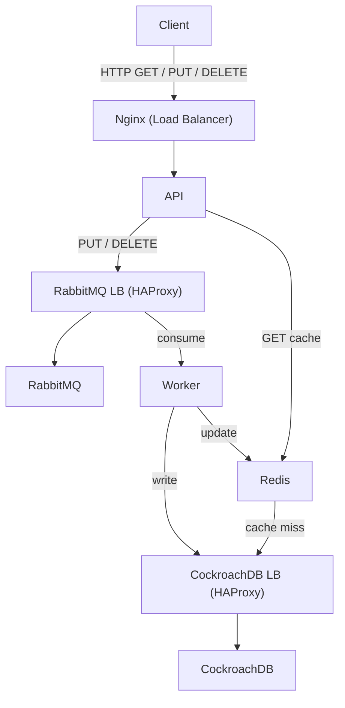

# Key-Value Store Distribuído

Este projeto consiste numa aplicação de armazenamento **chave-valor distribuída**, desenvolvida no âmbito da unidade curricular de **Sistemas Paralelos e Distribuídos**.

A aplicação segue uma arquitetura baseada em **microserviços**, integrando:

* **API REST em Spring Boot**
* **Cache distribuída com Redis Cluster**
* **Sistema de mensagens assíncronas com RabbitMQ Cluster**
* **Persistência distribuída com CockroachDB**
* **Balanceamento de carga com NGINX e HAProxy**
* **Execução e orquestração com Docker e Docker Compose**


## Arquitetura



### Componentes:

* **NGINX**: Entrada das requisições (porta 8000)
* **Spring Boot APIs** (`api-1`, `api-2`, `api-3`): Expõem endpoints REST (`PUT`, `GET`, `DELETE`)
* **Redis Cluster** (6 nós): Armazenamento temporário chave-valor
* **RabbitMQ Cluster** (3 nós): Comunicação assíncrona com quorum queues
* **Consumers Python** (3 instâncias): Tratam as mensagens e gravam dados
* **CockroachDB** (3 nós): Base de dados relacional distribuída
* **HAProxy**: Balanceador interno (DB e RabbitMQ)

---

## Manual da API

O manual interativo da API (Swagger UI) pode ser acedido em:  
[`http://localhost:8000/swagger-ui/index.html`](http://localhost:8000/swagger-ui/index.html)


### `PUT /store`

```json
{
    "key": "exemplo",
    "value": "valor123"
}
```
---

### `GET /store/exemplo`

```json
{
    "value": "valor123"
}
```

---

### `DELETE /store/exemplo`

HTTP Response Code

---

## Instalação e Utilização

### Requisitos

* Docker e Docker Compose
* GNU/Linux

### Como correr

```bash
git clone https://github.com/a74800/Atividade2-Key_Value
cd Atividade2-Key_Value
chmod +x start.sh
./start.sh
```

* API disponível em: `http://localhost:8000/store/`
* Painel RabbitMQ: `http://localhost:15672` (guest / guest)
* CockroachDB UI: `http://localhost:8080`

---

## Capacidades

| Componente    | Capacidade                                  |
| ------------- | ------------------------------------------- |
| Redis Cluster | 3 shards com 3 réplicas (6 nós no total)    |
| RabbitMQ      | 3 nós com filas tipo quorum                 |
| CockroachDB   | 3 nós com replicação automática             |
| APIs          | Escaláveis horizontalmente (N x instâncias) |
| Balanceamento | NGINX externo + HAProxy interno             |

---

## Testes de Carga

Executado com a ferramenta `jmeter`:


---

## 📚 Bibliografia e Apoio

* [Docker](https://docs.docker.com/)
* [Spring Boot](https://spring.io/)
* [Redis Cluster](https://redis.io/)
* [RabbitMQ](https://www.rabbitmq.com/)
* [CockroachDB](https://www.cockroachlabs.com/)
* Parte da documentação e código teve apoio de modelos de linguagem IA (ChatGPT)


-----------------------------------------------

# 🗃️ Sistema Distribuído de Armazenamento Chave-Valor

Este projeto implementa um sistema de armazenamento **chave-valor distribuído**, desenvolvido no âmbito da unidade curricular de **Sistemas Paralelos e Distribuídos** (UAlg, 2024/2025).

A arquitetura segue o modelo de **microserviços**, promovendo modularidade, tolerância a falhas e escalabilidade horizontal.

---

## ⚙️ Tecnologias Utilizadas

- **API REST**: Spring Boot
- **Cache Distribuída**: Redis Cluster (6 nós)
- **Mensageria Assíncrona**: RabbitMQ Cluster (3 nós, com quorum queues)
- **Base de Dados Distribuída**: CockroachDB (3 nós)
- **Balanceadores**: NGINX (externo) e HAProxy (interno)
- **Consumers**: Python (`aio-pika`, `asyncpg`)
- **Contêineres e Orquestração**: Docker + Docker Compose

---

## 📐 Arquitetura

```mermaid
graph TD
    Client -->|HTTP| NGINX
    NGINX -->|REST| API[Spring Boot APIs]
    API -->|GET| Redis
    Redis -->|Miss| DBLB[HAProxy → CockroachDB]
    API -->|PUT/DELETE| RMLB[HAProxy → RabbitMQ]
    RMLB --> RabbitMQ
    RabbitMQ --> Worker[Consumers Python]
    Worker -->|Gravação| DBLB
    Worker -->|Cache Update| Redis
